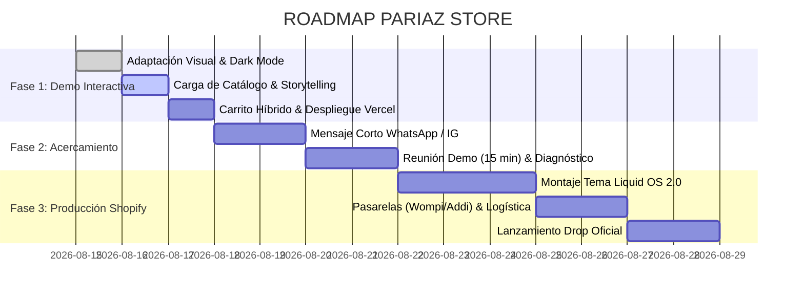

Viewed README.md:1-95
Viewed INTEGRACION_SHOPIFY.md:1-279
Ran command: `ls -la`
Viewed image.png:1-800
Viewed index.html:1-150

### 💎 Análisis Estratégico, Arquitectura y Roadmap Detallado: Caso PARIAZ STORE

Tras analizar la visión de negocio en `.md`, la historia de marca en `image.png` y la plantilla técnica en `L-ESSENCE`, aquí tienes la evaluación estratégica completa, la arquitectura recomendada y el roadmap de ejecución para construir la **DEMO inicial** y cerrar la propuesta comercial.

---

```
                                    EMBUDO INTEGRADO PARIAZ
  
   [ Tráfico Viral / Hype ]           [ Conversión Inmediata ]           [ Cierre y Retención ]
   • Instagram (Reels/Stories)  ──►  • Web E-commerce PARIAZ     ──►  • Checkout Online (Wompi/Bold)
   • TikTok / Comunidad              • Colecciones / Drops            • Pedido 1-Click WhatsApp
   • Artistas (Blessd, Kris R)       • Lookbook / Hotspots            • CRM / Re-compra por Drops
```

---

## 1. Diagnóstico de Oportunidad y Posicionamiento de Marca

### El Diagnóstico del Negocio

* **Situación Actual:** Tienda formal registrada en Sabaneta (Cámara de Comercio Aburrá Sur), con alta demanda impulsada por artistas urbanos y viralidad, pero vendiendo exclusivamente por **WhatsApp manual**.
* **El Cuello de Botella:** La atención que generan se diluye en chats no atendidos a tiempo, preguntas repetitivas de tallas/precios y fricción en transferencias manuales. Su tienda anterior en Shopify fue desactivada, perdiendo datos de clientes y compras recurrentes.
* **El Ángulo de Entrada:** **No vender "una página web"**, sino presentar una **infraestructura de captura de demanda y monetización de drops** que conviva con WhatsApp y automatice el 80% de las ventas.

### El ADN de Marca (Streetwear con Propósito)

A diferencia de marcas genéricas de ropa, PARIAZ tiene una narrativa de **superación, disciplina, perseverancia y venir desde abajo**:

* **Look & Feel:** High-End Streetwear / Dark Mode / Brutalismo Urbano elegante (referencias: *Represent Clo, Corteiz, Fear of God, Off-White*).
* **Prueba Social Clave:** Sección estelar de artistas y embajadores (*Worn By: Blessd, Kris R, etc.*).
* **Sentido de Escasez:** Drops limitados por tiempo con temporizadores y contadores de stock.

---

## 2. Evaluación de Estrategia, Arquitectura y Herramientas

Evaluamos las 3 opciones para crear la **DEMO inicial** y la **versión final**:

| Criterio | Opción A: Web App Interactiva (HTML5/CSS3/JS o Vite + Vercel) | Opción B: Shopify Directo (Liquid OS 2.0 / `mi-tema-lociones`) | Opción C: Headless Commerce (Next.js + Shopify Storefront API) |
| :--- | :--- | :--- | :--- |
| **Velocidad de carga de Demo** | ⚡ **Instantánea (< 0.8s)** | ⚠️ Media (depende de servidores Shopify) | ⚡ Rápida |
| **Acceso para el Cliente** | 🚀 **Link público directo sin contraseñas** (`pariaz.vercel.app`) | 🔒 Requiere contraseña de tienda en desarrollo | 🚀 Link público directo |
| **Libertad de Micro-animaciones y Video** | 🔥 **Total (video reel, cursor custom, canvas)** | ⚙️ Limitada a la estructura de Shopify | 🔥 Total |
| **Complejidad / Tiempo de Demo** | ⏱️ **Rápida (1 a 2 días adaptando `L-ESSENCE`)** | ⏱️ Media (configuración de tienda y admin) | ⏱️ Alta (requiere backend y setup API) |
| **Transición a Producción** | Fácil exportación a tema Shopify usando la guía `INTEGRACION_SHOPIFY.md` | Inmediata en Shopify | Requiere hosting dedicado continuo |

### 🏆 Veredicto de Arquitectura: Estrategia Híbrida en 2 Fases

1. **Fase DEMO (Para el Pitch / Contacto en Frío):**
   * **Base Técnica:** Adaptar el frontend interactivo de `L-ESSENCE` (`index.html`, `styles.css`, `app.js`).
   * **Despliegue:** Vercel o Netlify con un subdominio limpio (ej: `pariaz-demo.vercel.app`).
   * **Por qué:** Permite que el dueño o encargado abra el link desde su celular en WhatsApp y cargue **instantáneamente**, con reproducción de video de fondo, carrito lateral dinámico, selector de tallas y generador de mensaje directo a WhatsApp con el pedido armado.
2. **Fase PRODUCCIÓN (Tras el Cierre del Contrato):**
   * **Base Técnica:** Migrar la maqueta aprobada a **Shopify Online Store 2.0 (Liquid)** utilizando la estructura ya modularizada en `L-ESSENCE/mi-tema-lociones/`.
   * **Pasarelas en Colombia:** Wompi, Bold, Mercado Pago, Addi (pago a cuotas) y Contra Entrega.

---

## 3. Plan de Transformación de `L-ESSENCE` a PARIAZ

La plantilla `L-ESSENCE` ya cuenta con la base técnica necesaria (Cart Drawer AJAX, Hotspots Shop-the-Look, Tabs, Timeline, Countdown, WhatsApp checkout). La transformación se centrará en los siguientes cambios:

```
L-ESSENCE (Perfumería Luxury / Oro / Blanco)  ──►  PARIAZ (Streetwear Urbano / Dark / Neón / High Contrast)
```

1. **Paleta de Colores & Tipografía:**
   * *Fondos:* Negro puro (`#0a0a0a`), Gris asfalto (`#141414`), Acentos en Blanco titanio (`#ffffff`) y Rojo carmesí / Lima ácido para llamadas a la acción de drops.
   * *Fuentes:* **Syne** / **Clash Display** / **Bebas Neue** para títulos de impacto urbano; **Outfit** / **Inter** para textos legibles de tallas y descripciones.
2. **Estructura de Secciones de la Demo:**
   * **Barra de Anuncios:** `DROP 004: DISPONIBLE HASTA AGOTAR EXISTENCIAS [CUENTA REGRESIVA]`.
   * **Hero Principal:** Video / Reel dinámico con modelos y prendas en movimiento + Tipografía brutalista *"MÁS QUE UNA MARCA"*.
   * **Marquesina Ticker:** `SUPERACIÓN • DISCIPLINA • STREETWEAR • MEDELLÍN • ENVÍOS NACIONALES`.
   * **Sección "Worn By / Artistas":** Galería tipo lookbook con fotos de Blessd, Kris R y referentes con la marca.
   * **Drop Actual (Catálogo con Tabs):** Camisetas Oversize, Hoodies, Chaquetas, Gorras con precios en COP ($170.000, $240.000, etc.).
   * **Shop The Look (Hotspots):** Outfit completo donde al tocar los puntos se desglosa el precio de la gorra, camiseta y pantalón.
   * **Storytelling / La Historia:** Bloque narrativo basado en `image.png` (*"La historia de superación de su fundador, disciplina y perseverancia"*).
   * **Cart Drawer Híbrido:** Botón dual: **[Pagar con Tarjeta/PSE]** y **[Completar Pedido vía WhatsApp]**.

---

## 4. Roadmap de Ejecución Paso a Paso



### Etapa 1: Construcción de la DEMO (Días 1 a 3)

* **Paso 1.1:** Ajustar estilos de `L-ESSENCE` a la estética Streetwear (modo oscuro, contrastes, bordes rectos/micro-redondeados).
* **Paso 1.2:** Inyectar 6 productos reales de PARIAZ con selectores de talla (S, M, L, XL, XXL) y guía de medidas.
* **Paso 1.3:** Implementar el módulo "Artistas / Embajadores" y la historia de superación de la marca.
* **Paso 1.4:** Configurar la integración con WhatsApp para que el carrito genere un texto ordenado:

  ```text
  🔥 NUEVO PEDIDO - PARIAZ WEB 🔥
  • 1x Camiseta Oversize Black (Talla L) - $170.000
  • 1x Gorra Pariaz 001 - $95.000
  Total: $265.000 COP
  Cliente: [Nombre] | Ciudad: [Ciudad]
  ```

* **Paso 1.5:** Desplegar en Vercel con URL optimizada y probar fluidez en smartphones iOS y Android.

### Etapa 2: Contacto Estratégico & Pitch (Días 4 a 6)

* **Paso 2.1:** Enviar el mensaje de aproximación breve (sin precio, enfocado en conectar con el líder comercial/digital).
* **Paso 2.2:** Realizar llamada corta (15 min) o demo interactiva guiada enfocada en:
  1. Cómo capturar ventas 24/7 sin depender de contestar chats en vivo.
  2. Cómo retener a los clientes para avisarles de futuros drops sin pagar publicidad adicional.
  3. Cómo mantener WhatsApp como canal VIP de soporte y atención personalizada.

### Etapa 3: Implementación en Producción Shopify (Días 7 a 12)

* **Paso 3.1:** Crear tienda de desarrollo en Shopify Partners.
* **Paso 3.2:** Subir el tema `mi-tema-lociones` ya adaptado usando Shopify CLI (`shopify theme push`).
* **Paso 3.3:** Conectar pasarelas de pago colombianas (Wompi para tarjetas/PSE, Addi para crédito rápido, Bold).
* **Paso 3.4:** Configurar Meta Pixel y Conversion API (CAPI) para medir el retorno de los posts de artistas e influencers.

---

## 5. Estrategia de Paquetes y Precios para la Propuesta

Para presentar una cotización profesional cuando el cliente pida precios tras ver la demo:

| Componente | Plan 1: Starter Drop | Plan 2: E-commerce Pro (Recomendado) | Plan 3: Full Ecosystem & Growth |
| :--- | :--- | :--- | :--- |
| **Objetivo** | Landing de catálogo + WhatsApp | Tienda Shopify completa con pasarelas | Sistema completo con CRM y Retención |
| **Tienda Web** | Catálogo interactivo móvil | Shopify OS 2.0 autoadministrable | Shopify OS 2.0 Ultra-Personalizado |
| **Checkout** | Redirección a WhatsApp | Checkout Online (Wompi, PSE, Tarjeta, Addi) | Checkout Online + WhatsApp VIP |
| **Automatización** | — | Notificaciones de pedido por Email/SMS | Carritos abandonados automáticos |
| **Data & Tracking** | Google Analytics básico | Pixel de Meta + Conversions API | Tracking avanzado de influencers/artistas |
| **Rango Sugerido (COP)** | $1.8M – $2.5M COP | $3.5M – $5.2M COP | $6.5M – $8.5M COP (+ % o fee mensual) |

---

## Siguiente Paso Inmediato

Podemos comenzar directamente adaptando la maqueta de `L-ESSENCE` para convertirla en el **demo funcional de PARIAZ STORE** (actualizando paleta de colores, tipografías, catálogo streetwear, módulo de artistas y checkout híbrido).
